# Deep Code Review: convex-tanstack-cloudflare

Comprehensive review comparing the codebase against official documentation for **Convex + Better Auth**, **TanStack Start**, **Cloudflare Workers**, and **@convex-dev/react-query**.

---

## 🔴 Critical Issues

### 1. Missing `BETTER_AUTH_SECRET` Environment Variable

**Source:** [Official docs — Set environment variables](https://labs.convex.dev/better-auth/framework-guides/tanstack-start#set-environment-variables)

The official guide requires `BETTER_AUTH_SECRET` to be set on the Convex deployment for encryption and hashing:

```bash
npx convex env set BETTER_AUTH_SECRET=$(openssl rand -base64 32)
```

Your [auth.ts](file:///Users/mandulaj/dev/source/convex-tanstack-cloudflare/convex/auth.ts) doesn't reference it, and it's not in [.env.example](file:///Users/mandulaj/dev/source/convex-tanstack-cloudflare/.env.example). While `@convex-dev/better-auth` may auto-generate one, the docs explicitly require it. Without a stable secret, session tokens may become invalid across deployments.

> [!CAUTION]
> If `BETTER_AUTH_SECRET` is not set, sessions may break on redeployment and security is weakened.

---

### 2. Missing `expectAuth: true` in ConvexQueryClient

**Source:** [Official docs — SSR with TanStack Query](https://labs.convex.dev/better-auth/framework-guides/tanstack-start#ssr-with-tanstack-query)

The docs state:

> "A seamless initial render currently requires `expectAuth: true` in the `ConvexQueryClient` constructor."

Your [router.tsx](file:///Users/mandulaj/dev/source/convex-tanstack-cloudflare/src/router.tsx#L10):
```diff
- const convexQueryClient = new ConvexQueryClient(env.VITE_CONVEX_URL)
+ const convexQueryClient = new ConvexQueryClient(env.VITE_CONVEX_URL, { expectAuth: true })
```

Without this, Convex functions may fire **before** authentication is ready on the client, causing auth errors or flickering UI states.

---

### 3. Missing Sign-Out Page Reload

**Source:** [Official docs — Signing out with expectAuth: true](https://labs.convex.dev/better-auth/framework-guides/tanstack-start#signing-out-with-expectauth-true)

The docs explicitly warn:

> "The `expectAuth: true` setting only has affect before the initial authentication. If a user signs out and signs back in, authenticated queries will be called before authentication is ready. **The current recommendation is to reload the page on sign out.**"

Your [index.tsx](file:///Users/mandulaj/dev/source/convex-tanstack-cloudflare/src/routes/index.tsx#L74-L76) just calls `signOut()` without reloading:
```diff
  const handleSignOut = () => {
-   signOut()
+   signOut({
+     fetchOptions: {
+       onSuccess: () => { location.reload() }
+     }
+   })
  }
```

---

### 4. `setAdminByEmail` Mutation Is a No-Op

[users.ts:97-144](file:///Users/mandulaj/dev/source/convex-tanstack-cloudflare/convex/users.ts#L97-L144): This mutation accepts `email` and `isAdmin` but **does nothing meaningful**. It just `console.log`s an instruction to manually edit `config.ts`. The auth check is fully commented out, the mutation has no authorization, and anyone can call it.

**Risk:** A public-facing mutation with no auth guard that appears to grant admin access but is actually inert is confusing and potentially dangerous if someone later uncomments the write logic without also uncommenting the auth check.

**Recommendation:** Either implement it properly with the Better Auth admin plugin, or delete it entirely and document the config-file approach only.

---

## 🟡 Moderate Issues

### 5. In-Memory Rate Limiting Despite Having `@convex-dev/rate-limiter` Installed

[package.json](file:///Users/mandulaj/dev/source/convex-tanstack-cloudflare/package.json#L33) shows `@convex-dev/rate-limiter: ^0.3.2` installed, but:
- It's **not registered** in [convex.config.ts](file:///Users/mandulaj/dev/source/convex-tanstack-cloudflare/convex/convex.config.ts)
- The actual rate limiting in [rateLimitService.ts](file:///Users/mandulaj/dev/source/convex-tanstack-cloudflare/convex/lib/services/rateLimitService.ts) uses **in-memory `Map`**, which:
  - Resets on every deploy
  - Doesn't share state across Convex function instances
  - Is effectively useless in production

**Recommendation:** Either use `@convex-dev/rate-limiter` properly (register component, use its API) or remove the dependency and clearly document the rate limiting as demo-only.

---

### 6. Duplicated `getAuthUserSafe` Helper

The exact same function is defined in **three places**:
1. [users.ts:39-45](file:///Users/mandulaj/dev/source/convex-tanstack-cloudflare/convex/users.ts#L39-L45)
2. [files.ts:11-17](file:///Users/mandulaj/dev/source/convex-tanstack-cloudflare/convex/files.ts#L11-L17)
3. [authHelpers.ts:69-72](file:///Users/mandulaj/dev/source/convex-tanstack-cloudflare/convex/lib/authHelpers.ts#L69-L72) (as `getAuthUser`, without try/catch)

`users.ts` and `files.ts` should import from `authHelpers.ts` and add the try-catch wrapper there once. The current duplication is a maintenance burden and invites inconsistency.

---

### 7. `auth-server.ts` Uses `import.meta.env` Instead of `process.env`

**Source:** [Official docs](https://labs.convex.dev/better-auth/framework-guides/tanstack-start#configure-tanstack-server-utilities)

The official guide uses `process.env.VITE_CONVEX_URL!` for the server utilities. Your [auth-server.ts](file:///Users/mandulaj/dev/source/convex-tanstack-cloudflare/src/lib/auth-server.ts#L6-L7) uses `env.VITE_CONVEX_URL` which comes from [env.ts](file:///Users/mandulaj/dev/source/convex-tanstack-cloudflare/src/lib/env.ts) that reads `import.meta.env`.

While this works in development, `import.meta.env` in a Cloudflare Worker SSR context may not resolve the same way. The official docs prefer `process.env` for server-side code. Also, `VITE_CONVEX_SITE_URL` has a non-null assertion (`!`) which will throw at runtime if not set — better to validate gracefully.

---

### 8. Zod v4 API Differences

[package.json](file:///Users/mandulaj/dev/source/convex-tanstack-cloudflare/package.json#L48) uses `zod: ^4.3.5`, but [env.ts](file:///Users/mandulaj/dev/source/convex-tanstack-cloudflare/src/lib/env.ts) uses `.safeParse()` and `.flatten()` which are Zod v3 patterns. While Zod v4 maintains backward compatibility for these, the error format has changed. Verify that `parsed.error.flatten().fieldErrors` produces the expected output in Zod v4, or pin to Zod v3 (`^3.x`) for stability.

---

### 9. Missing `VITE_SITE_URL` in Environment

The official docs specify a `VITE_SITE_URL` env var (separate from `SITE_URL` on Convex). Your `.env.example` and `env.ts` don't include it. This may cause issues with redirect URLs during OAuth flows.

---

### 10. `convex/react` Manual Chunk May Break

[vite.config.ts:57](file:///Users/mandulaj/dev/source/convex-tanstack-cloudflare/vite.config.ts#L57):
```js
'convex-vendor': ['convex/react'],
```

This references `convex/react` as a manual chunk, but the project uses `@convex-dev/react-query` (not `convex/react` directly) for its React integration. The `ConvexBetterAuthProvider` uses the Convex client internally but doesn't expose `convex/react`. This chunk definition may be pulling in unused code or may fail silently if the module isn't directly imported.

---

## 🟢 Minor Issues & Suggestions

### 11. Missing `requestAnimationFrame` Scheduler

The official router setup includes:
```ts
if (typeof document !== 'undefined') {
  notifyManager.setScheduler(window.requestAnimationFrame)
}
```

Your [router.tsx](file:///Users/mandulaj/dev/source/convex-tanstack-cloudflare/src/router.tsx) is missing this. It helps with React 18+ batching behavior.

---

### 12. Stale `compatibility_date` in Wrangler Config

[wrangler.jsonc](file:///Users/mandulaj/dev/source/convex-tanstack-cloudflare/wrangler.jsonc#L4): `"compatibility_date": "2025-01-01"` is over a year old. Update to a recent date (e.g., `2026-01-15`) to opt into newer Worker runtime features.

---

### 13. No `loader` for SSR Data Fetching

The official docs recommend using `ensureQueryData` in route loaders for seamless SSR:
```ts
loader: async ({ context }) => {
  await context.queryClient.ensureQueryData(
    convexQuery(api.messages.list, {})
  )
}
```

Neither [index.tsx](file:///Users/mandulaj/dev/source/convex-tanstack-cloudflare/src/routes/index.tsx) nor [files.tsx](file:///Users/mandulaj/dev/source/convex-tanstack-cloudflare/src/routes/files.tsx) use `loader` or `useSuspenseQuery`. Messages and files are fetched client-side only, which means:
- No SSR for content — slower perceived load
- SEO won't see any dynamic content

---

### 14. `files.tsx` Should Be a Protected Route

The [files.tsx](file:///Users/mandulaj/dev/source/convex-tanstack-cloudflare/src/routes/files.tsx) page requires authentication but handles auth-checking inline instead of using the existing `_authenticated` layout route. Moving it to `src/routes/_authenticated/files.tsx` would:
- Eliminate duplicated auth-check UI code
- Provide consistent redirect behavior
- Keep the pattern uniform across the app

---

### 15. Missing Content Validation on `messages.send`

[messages.ts:17-19](file:///Users/mandulaj/dev/source/convex-tanstack-cloudflare/convex/messages.ts#L17-L19): The `send` mutation accepts `content: v.string()` with no length validation. Users could submit empty strings (just whitespace) or extremely long messages. Add validation:
```ts
args: {
  content: v.string(), // Consider adding length check in handler
}
```

---

### 16. Dashboard Route Is a Placeholder

[_authenticated/dashboard.tsx](file:///Users/mandulaj/dev/source/convex-tanstack-cloudflare/src/routes/_authenticated/dashboard.tsx) is a bare-bones placeholder with hardcoded `text-gray-600` instead of the theme's semantic classes (`text-muted-foreground`).

---

### 17. No File Size Limit on Uploads

[files.tsx](file:///Users/mandulaj/dev/source/convex-tanstack-cloudflare/src/routes/files.tsx): No client-side validation for file size or type before upload. Users could attempt to upload arbitrarily large files.

---

### 18. `createdAt` Uses `Date.now()` Instead of `_creationTime`

Both `messages` and `files` tables store a manual `createdAt: v.number()`. Convex provides `_creationTime` automatically on every document. The manual field is redundant unless you need to override it (e.g., for migration/seeding). Consider dropping the custom field and using `_creationTime`.

---

## ✅ What's Done Well

| Area | Assessment |
|------|-----------|
| **Convex + Better Auth integration** | Follows the official component pattern correctly (`createClient`, `registerRoutes`, `convex()` plugin) |
| **SSR auth token setup** | Root route's `beforeLoad` + `serverHttpClient.setAuth(token)` matches official docs exactly |
| **Auth client** | `convexClient()` plugin usage is correct — avoids CORS issues |
| **Protected routes** | `_authenticated.tsx` layout with redirect works well |
| **RBAC pattern** | Clean separation: `requireAuth` / `requireAdmin` / `isAdmin` helper chain |
| **Impersonation** | Thoughtful "View as User" feature with proper admin flag splitting |
| **Error boundary** | Class-based boundary with Sentry integration and dev-mode details |
| **Theme system** | CSS custom properties with light/dark modes via shadcn/ui pattern |
| **Skeleton loading** | Home page has a proper skeleton component — good UX practice |
| **TypeScript strictness** | `noUncheckedIndexedAccess`, `strict`, `noUnusedLocals` are all enabled |
| **CI-ready scripts** | Complete dev/build/test/deploy pipeline in `package.json` |

---

## Priority Recommendation

```mermaid
graph TD
    A[🔴 1. Add BETTER_AUTH_SECRET] --> B[🔴 2. Add expectAuth: true]
    B --> C[🔴 3. Fix sign-out reload]
    C --> D[🔴 4. Fix/remove setAdminByEmail]
    D --> E[🟡 5. Fix rate limiting]
    E --> F[🟡 6. Deduplicate getAuthUserSafe]
    F --> G[🟡 7-10. Env & config fixes]
    G --> H[🟢 11-18. Polish items]
```



Start with the 🔴 critical items — they affect **security** and **auth correctness** in production.
